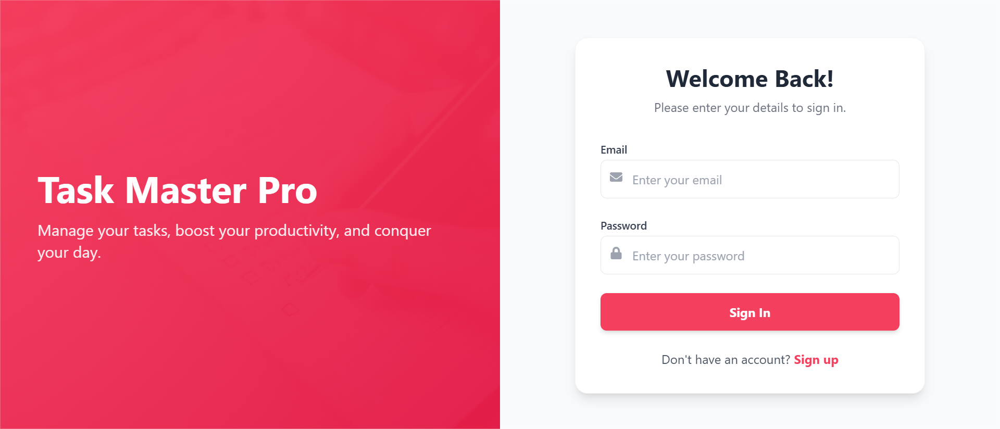
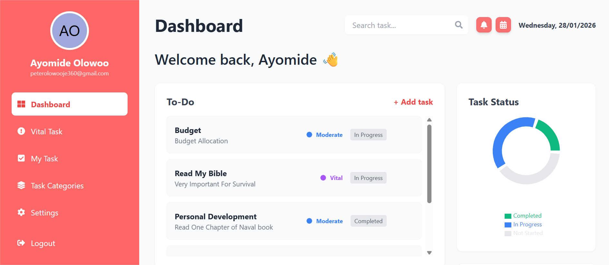

# 🚀 Task Master Pro


**Task Master Pro** is a robust, full-stack task management application designed to boost productivity. Built with the **MERN Stack** (MongoDB, Express, React, Node.js) and **TypeScript**, it features secure authentication, real-time updates, and a beautiful, responsive UI.

---

## 🌐 Live Demo

- **Frontend (Vercel):** https://task-master-pro-lime.vercel.app
- **Backend (Render):** https://task-master-api-u5xy.onrender.com

---

## ✨ Key Features

- **🔐 Secure Authentication:** JWT-based Login & Registration with password encryption.
- **📊 Interactive Dashboard:** Visual charts and stats for task progress (In Progress vs. Completed).
- **✅ Task Management:** Create, Read, Update, and Delete (CRUD) tasks effortlessly.
- **🏷️ Categorization:** Organize tasks by categories (Work, Personal, Health, Finance).
- **⚡ Real-time Updates:** Instant status changes and priority tagging (Vital, High, Moderate, Low).
- **🎨 Modern UI:** Fully responsive design built with **Tailwind CSS** and **Rose-500** theme.
- **⚙️ User Settings:** Profile management with avatar support (Upload URL or Auto-Initials).

---

## 🛠️ Tech Stack

### **Frontend**

- **React (Vite):** Fast and modern UI library.
- **TypeScript:** For type safety and better developer experience.
- **Tailwind CSS:** Utility-first styling for a sleek look.
- **Axios:** For handling API requests.
- **Recharts:** For data visualization.

### **Backend**

- **Node.js & Express:** Scalable server-side logic.
- **MongoDB & Mongoose:** NoSQL database for flexible data storage.
- **JSON Web Token (JWT):** Secure stateless authentication.
- **Bcrypt.js:** Password hashing.

---

## 📸 Screenshots

|                  Login Page                  |                      Dashboard                       |
| :------------------------------------------: | :--------------------------------------------------: |
|  |  |

---

## 🚀 Getting Started (Run Locally)

Follow these steps to run the project on your machine.

### **1. Clone the Repository**

```bash
git clone [https://github.com/3ayomidepeter/Task-Master-Pro.git](https://github.com/3ayomidepeter/Task-Master-Pro.git)
cd Task-Master-Pro

2. Backend Setup
Navigate to the server folder and install dependencies.
cd server
npm install

Create a .env file in the server folder:
PORT=5000
MONGO_URI=your_mongodb_connection_string
JWT_SECRET=your_secret_key

Start the Server:
npm run dev

3. Frontend Setup
Open a new terminal, navigate to the client folder, and install dependencies.

cd client
npm install
npm run dev

## 📡 API Endpoints

| Method | Endpoint | Description |
|--------|----------|-------------|
| POST   | `/api/auth/register` | Register a new user |
| POST   | `/api/auth/login`    | Login user & get token |
| PUT    | `/api/auth/profile`  | Update user profile |
| GET    | `/api/tasks`         | Get all tasks for logged-in user |
| POST   | `/api/tasks`         | Create a new task |
| PUT    | `/api/tasks/:id`     | Update a task |
| DELETE | `/api/tasks/:id`     | Delete a task |
```
